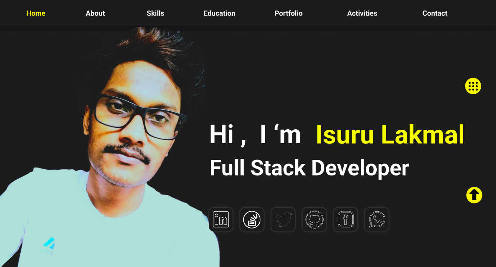
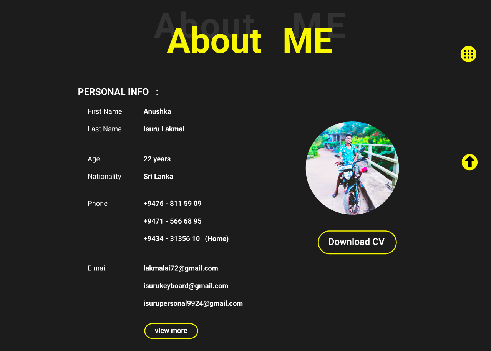
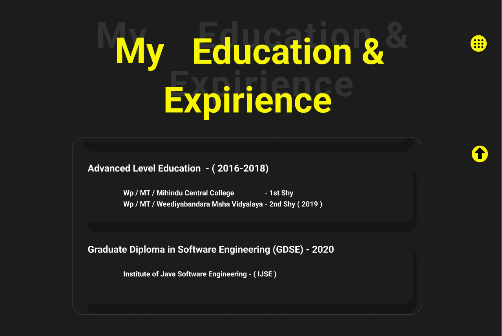
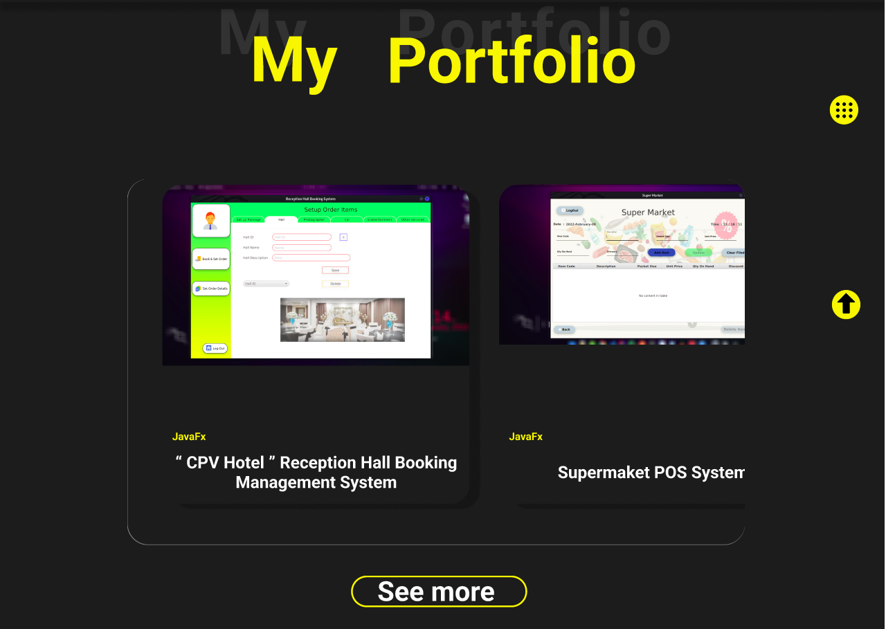
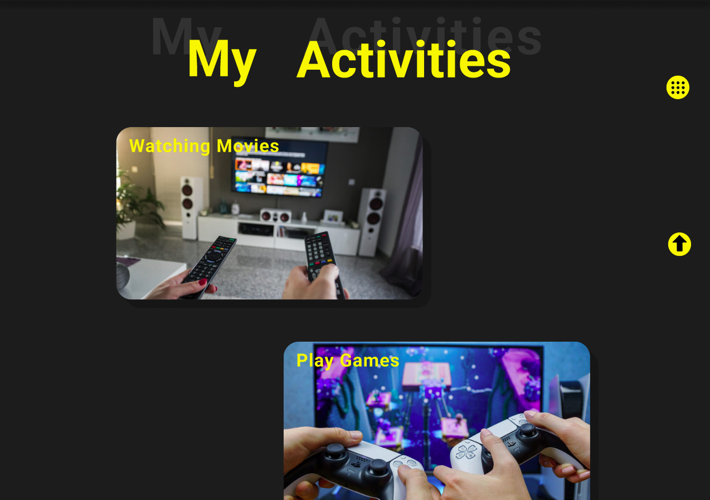
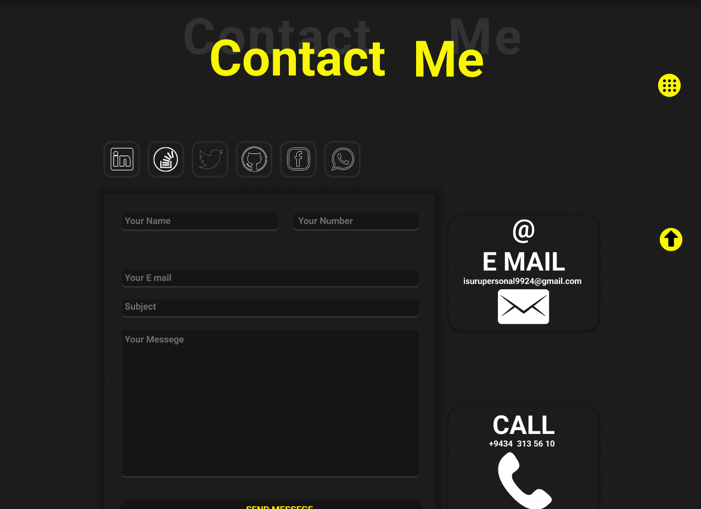

<h1 align="center">This is my profile</h1>

- My primary coding language : Java
- Graduate in Software Engineering at IJSE
- Programming Skills : Java, HTML, CSS, JavaScript, NodeJS
- Design Skills : AdobeXD, Figma, Photoshop, Illustrator etc.

<h2>Overview My Profile️ </h2>

<h3 align="center">Home Page</h3>

<h3 align="center">About Me</h3>

<h3 align="center">My Skills</h3>

<h3 align="center">Education & Experience</h3>

<h3 align="center">Portfolio</h3>

<h3 align="center">Activities</h3>

<h3 align="center">Contact</h3>

## :link: **Links**
- Site Map : [Click Here](https://www.gloomaps.com/nfzc9C2aWT)
- Wireframe : [Click Here](https://wireframe.cc/pro/pp/da44f8bd4516987)
- Mockup : [Click Here](https://www.figma.com/file/g2kYJpUuH6RpLOBsQYN6HS/Untitled?version-id=1539721373&node-id=1%3A2&viewport=241%2C48%2C0.25)
- Github page : [Click Here](https://isurugithu.github.io/My-Profile/)

## :link: **Other Links**
- LinkedIn : [Click Here](http://www.linkedin.com/in/isurulakmal99)
- Whatsapp : [Click Here](https://wa.me/message/GWIVXWGZ6AO6F1)
- Facebook : [Click Here](https://www.facebook.com/anushkaisurulakmal.lakmal/)
- Twitter  : [Click Here](https://twitter.com/AnushkaIsuru72?t=5B3SsIFbGZhhmsYqXuX0Yg&s=09)

<a href="https://github.com/pasindulakshankudaligama/Readme-File-Styles">
Isuru Lakmal Readme Profile !
</a>

  

